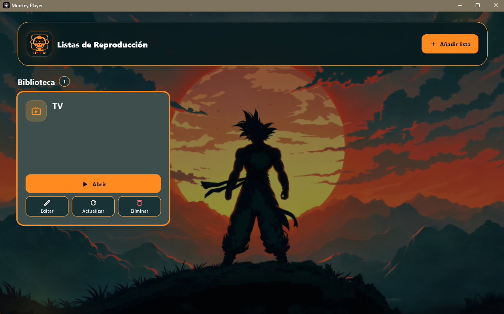
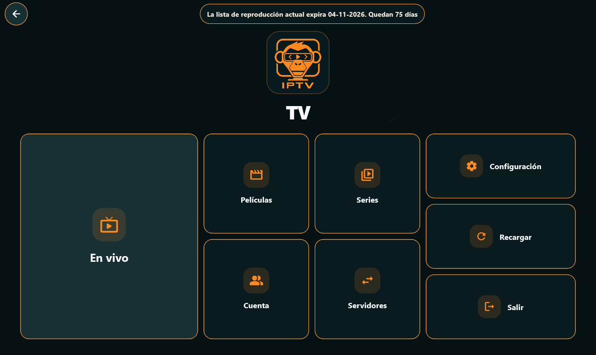

# 🐵 Monkey Player

**Monkey Player** es una aplicación multimedia compatible con **Xtream Codes** y listas **IPTV / M3U**, diseñada para ofrecer una experiencia cómoda, moderna y personalizable en distintos dispositivos.

> Monkey Player es únicamente un **reproductor / cliente multimedia**.  
> La aplicación **no incluye, distribuye ni proporciona listas IPTV, canales, películas, series, credenciales o contenido audiovisual de terceros**.

---

## ✨ Características

- 📺 Reproducción de **canales en directo**
- 🎬 Catálogo de **películas**
- 📚 Catálogo de **series**
- 🔗 Compatibilidad con **Xtream Codes**
- 📄 Compatibilidad con listas **M3U / IPTV**
- 🔎 Múltiples filtros para organizar y encontrar contenido
- 🎞️ Filtros y opciones relacionadas con la **calidad de reproducción**
- 🎨 Interfaz y apariencia **personalizables**
- 🖼️ Diseño visual configurable para adaptar la experiencia a cada dispositivo
- 🔄 Actualización y recarga de listas
- 💻 Compatibilidad con **Windows**
- 📱 Compatibilidad con **Android**
- 📺 Optimizada también para dispositivos Android TV, incluyendo **Amazon Fire TV / Fire TV Stick**

---

## 🖼️ Capturas

### Gestión de listas

### Menú principal

---

## 📥 Descargas

Las versiones más recientes se publican directamente en la sección de **Releases** de este repositorio.

### Android

**Descarga directa**

[Monkey Player para Android](https://github.com/alvruigut/Monkey-Player-Releases/releases/latest/download/Monkey-Player-Android.apk)

**Downloader**

- Código: `1539788`
- Enlace: http://aftv.news/1539788

---

### Fire TV / Android TV

**Descarga directa**

[Monkey Player para Fire TV](https://github.com/alvruigut/Monkey-Player-Releases/releases/latest/download/Monkey-Player-FireTV.apk)

**Downloader**

- Código: `5711692`
- Enlace: http://aftv.news/5711692

---

### Windows

**Descarga directa**

[Monkey Player para Windows](https://github.com/alvruigut/Monkey-Player-Releases/releases/latest/download/Monkey-Player-Windows.exe)

**Downloader**

- Código: `7138824`
- Enlace: http://aftv.news/7138824

---

## 🚀 Instalación rápida

### Android

1. Descarga el archivo `Monkey-Player-Android.apk`.
2. Permite la instalación de aplicaciones desde fuentes externas si Android lo solicita.
3. Instala el APK.
4. Añade tu propia lista o tus propias credenciales compatibles.

### Fire TV

Puedes descargar el APK desde el navegador del dispositivo o utilizando una aplicación tipo **Downloader** con el código indicado anteriormente.

### Windows

1. Descarga `Monkey-Player-Windows.exe`.
2. Ejecuta el instalador o ejecutable.
3. Configura tus propias listas o credenciales.

---

## ⚖️ Aviso legal

Monkey Player es un software cliente destinado a reproducir contenido proporcionado por el propio usuario mediante fuentes compatibles.

Este proyecto:

- **No vende ni distribuye listas IPTV.**
- **No proporciona cuentas Xtream Codes.**
- **No aloja canales, películas, series ni emisiones.**
- **No incluye contenido protegido por derechos de autor.**
- **No mantiene relación ni afiliación con proveedores IPTV de terceros.**
- Se limita a proporcionar la aplicación necesaria para que el usuario pueda utilizar sus propias fuentes legítimas.

Cada usuario es responsable de asegurarse de que dispone de los derechos, permisos o licencias necesarios para acceder al contenido que configure en la aplicación.

---

## 🔐 Privacidad y responsabilidad

Monkey Player no pretende facilitar el acceso no autorizado a contenido protegido. El uso de fuentes, listas, servidores o credenciales externas es responsabilidad exclusiva del usuario.

---

## 📦 Releases

Consulta siempre la última versión disponible en:

[GitHub Releases - Monkey Player](https://github.com/alvruigut/Monkey-Player-Releases/releases/latest)

---

  <strong>Monkey Player</strong> 
  Un reproductor IPTV/Xtream multiplataforma para Windows, Android y Fire TV.

